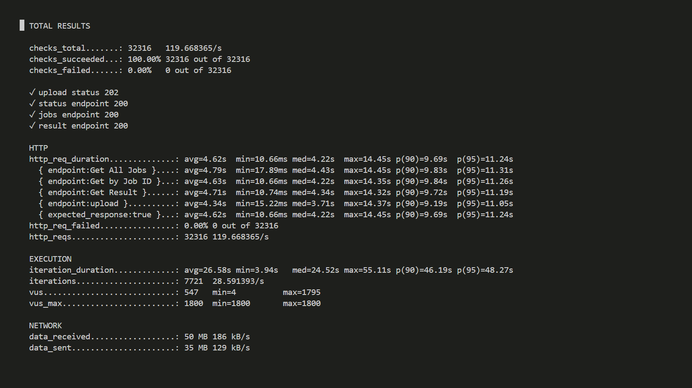
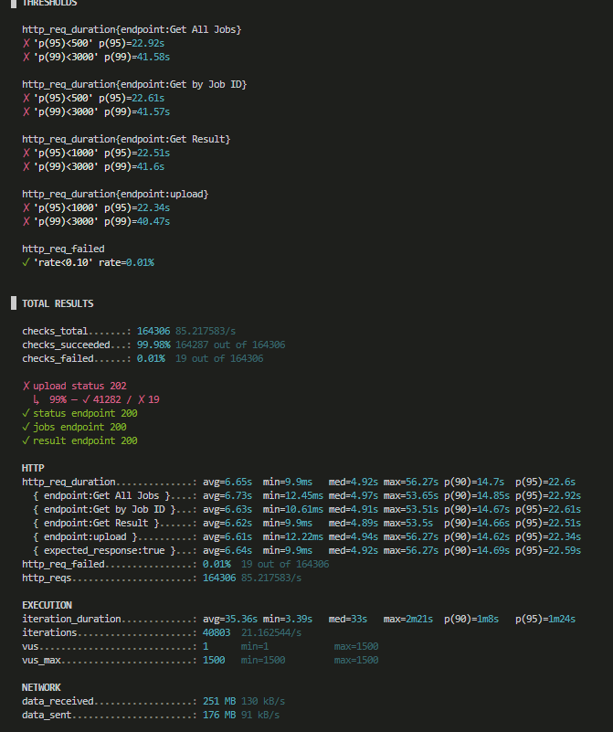
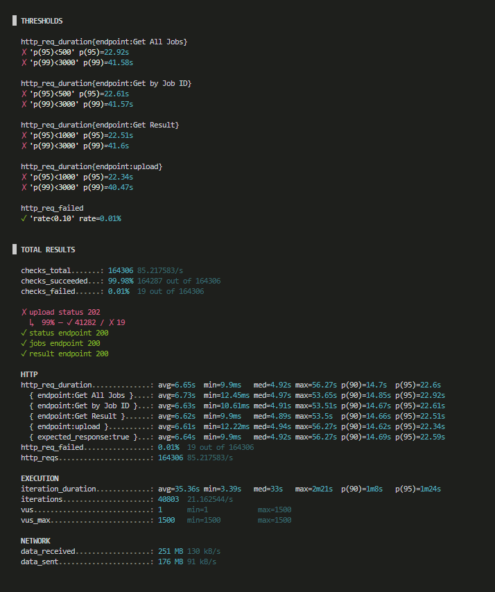
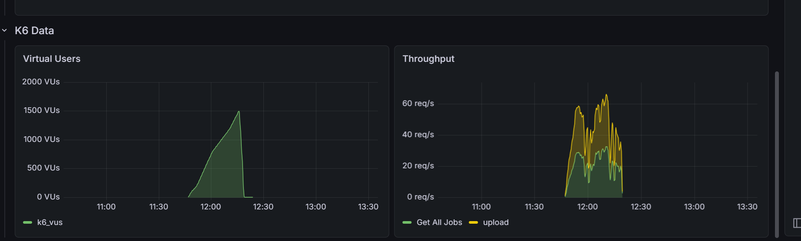
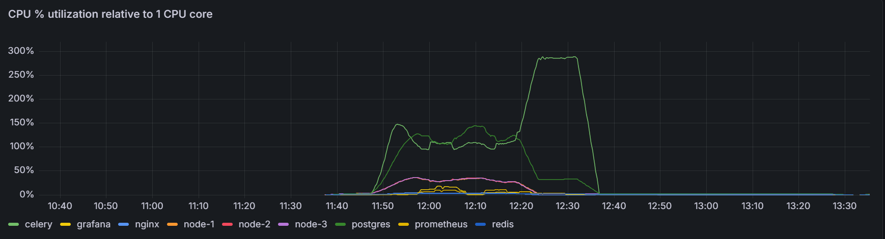

# LedgerLens AI

AI-powered financial reconciliation, anomaly detection, and reporting pipeline for bank and ledger CSV files.

## Overview

LedgerLens AI processes uploaded bank and ledger CSV files asynchronously using Django REST Framework, Celery, Redis, PostgreSQL, Nginx, and Groq. The system normalizes transaction data, matches entries across both files, identifies unresolved exceptions, and returns a structured summary with AI-generated insights.

This project is designed for reconciliation-heavy workflows where transaction records from different sources need to be compared, cleaned, and explained.

---

## Why this project exists

Modern finance teams often work with multiple data sources that do not share the same schema, naming conventions, or date formats. This project solves that by:

- normalizing messy CSV inputs
- reconciling bank and ledger transactions
- detecting mismatches and anomalies
- summarizing unresolved records
- exposing results through asynchronous APIs
- supporting load and stress testing in Docker

---

## Recommended project name

Suggested name: LedgerLens AI

It is short, memorable, and reflects both:
- the financial ledger reconciliation use case
- the AI-assisted intelligence layer

---

<!-- ADD DESIGN IMAGE -->
## Tech stack

| Component | Technology |
| --- | --- |
| API Layer | Django + Django REST Framework |
| Application Server | Gunicorn |
| Task Queue | Celery |
| Broker | Redis |
| Database | PostgreSQL |
| AI Provider | Groq |
| Reverse Proxy | Nginx |
| Containerization | Docker + Docker Compose |
| Load Testing | k6 |
| Monitoring | Prometheus + cAdvisor + Grafana |
| Data Processing | Pandas |

---

## Architecture

The application follows a containerized microservice-style deployment pattern:

- Nginx receives incoming HTTP traffic and forwards it to the Django app instances
- Django serves the REST API and stores job metadata in PostgreSQL
- Celery workers process uploaded files asynchronously
- Redis acts as the message broker and task backend
- Groq LLM is used to enrich summaries and classifications
- Prometheus and Grafana monitor system behavior during testing

---

## Project structure

```text
.
├── AI_transaction_processing_pipeline/
│   ├── __init__.py
│   ├── celery.py
│   ├── settings.py
│   ├── urls.py
│   ├── asgi.py
│   └── wsgi.py
├── jobs/
│   ├── models.py
│   ├── serializers.py
│   ├── services.py
│   ├── tasks.py
│   ├── urls.py
│   └── views.py
├── nginx/
│   └── nginx.conf
├── prometheus/
│   └── prometheus.yaml
├── tests/
│   ├── load.js
│   ├── stress.js
│   ├── bank_statement.csv
│   ├── ledger.csv
│   └── results.md
├── docker-compose.yml
├── Dockerfile
├── manage.py
├── Readme.md
├── requirements.txt
└── .env.docker
```

---

## Features

### CSV upload and job creation

- accepts bank and ledger CSV files
- creates a processing job immediately
- stores file metadata and job status in PostgreSQL
- queues processing through Celery

### Data cleaning and normalization

- normalizes mixed date formats
- removes currency symbols and noisy text from amounts
- standardizes currency and status values
- cleans vendor and narration names for matching

### Reconciliation engine

The project matches transactions across both files using a multi-step approach:

1. exact and fuzzy name matching
2. date and amount tolerance checks
3. split-transaction matching
4. combined-transaction matching
5. unresolved rows become exceptions

### Anomaly detection

The pipeline flags transactions when they appear suspicious, such as:

- amount spikes compared with historical spending patterns
- mismatched currency or geography assumptions
- merchant inconsistency between narration and source data

### AI-powered summaries

When needed, the system uses Groq to generate:

- narrative summary of the reconciliation result
- total spend by currency
- top merchants or counterparties
- anomaly and exception explanation
- risk or confidence signal

### API polling model

The API is asynchronous by design:

- upload returns a job ID immediately
- caller polls status and result endpoints
- job output is stored as structured JSON on the model

---

## Environment configuration

Create a `.env.docker` and `.env.local` file in the project root with values like:

```env
POSTGRES_DB=postgres
POSTGRES_USER=postgres
POSTGRES_PASSWORD=postgres
POSTGRES_HOST=db
POSTGRES_PORT=5432

JWT_SECRET_KEY=your-secret-key
DEBUG=False
TESTING=False
PROFILING=False

GROQ_API_KEY=visit here to get a GROQ API KEY https://console.groq.com/keys

CELERY_BROKER_URL=redis://redis:6379/0
CELERY_RESULT_BACKEND=redis://redis:6379/0
```
---

<!-- CHECKED -->
## Quick start

### 1. Clone the repo

```bash
git clone <repository-url>
cd Buildathon-temp-name
```

### 2. Create environment file

```bash
cp .env.docker.example .env.docker
```

or, 

```bash
cp .env.local.example .env.docker
```

Then edit the file with your actual database and API credentials.

### 3. Start the application

```bash
sudo docker compose up --build
```

This starts:

- Django API (Gunicorn)
- PostgreSQL
- Redis
- Celery worker
- Nginx
- Grafana / Prometheus / cAdvisor

The application will be started
---
<!-- DONE -->
## Load testing

Run the stress profile:

```bash
sudo docker compose --profile stresstest up --build
```

Run the load test profile:

```bash
sudo docker compose --profile loadtest up --build
```

The k6 scripts are under [tests](tests).

---
<!-- DONE/ -->
## API endpoints

### Upload files

```http
POST /jobs/upload/
```

Request:

```bash
curl -X POST \
  -F "bank_file=@bank_statement.csv" \
  -F "ledger_file=@ledger.csv" \
  http://localhost/jobs/upload/
```

Response:

```json
{
  "job_id": 1,
  "status": "pending"
}
```

### List jobs
```bash
curl -i http://localhost/jobs/
```

### Get job status
```bash
curl -i http://localhost/jobs/25862/status/
```

### Get job result
```bash
curl -i http://localhost/jobs/2862/result/
```
<!-- DONE -->
## Data Model

### Job

```text
id
bank_file
bank_filename
ledger_file
ledger_filername
created_at
completed_at
row_count_bank
row_count_ledger
match_rate
error
status
results (JSONField)
```

## Production notes

This setup is excellent for local testing and demonstration, but for a production-grade deployment you would likely add:

- multiple Gunicorn workers behind a load balancer
- more Celery workers
- PostgreSQL connection pooling
- structured logging and tracing
- object storage for uploaded files
- better retry and timeout policies for LLM calls
- caching for repeated data queries

---

## Result

### Stress Test




### Load Test





---

## Author

Abhinandan Thakur
